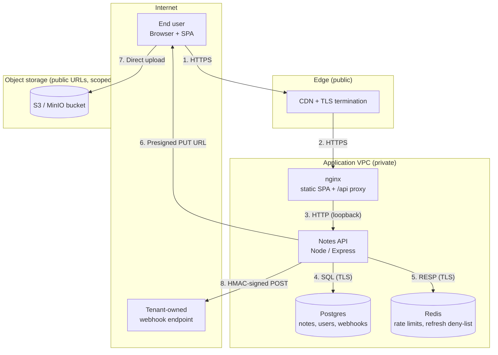

# Architecture & Threat Model Scope — Modern Notes SaaS

## Purpose

This document captures the logical architecture, trust boundaries, data
flows, and assets of the Notes SaaS so the threat modeler can reason about
threats at the architectural level.

## Deployment model

- Multi-tenant SaaS. Tenants are logical; all tenants share the same
  Postgres cluster and Redis instance, scoped by `tenant_id`.
- Services run as stateless containers behind a managed load balancer.
- TLS 1.3 at the edge (managed CDN). Internal traffic is mTLS-less but
  runs on a dedicated private network / VPC.
- Secrets are injected via the platform's secret manager (no secrets on
  disk in production images).

## Data Flow Diagram (Mermaid)

## Trust boundaries

- **TB-1** Public internet ↔ CDN (TLS edge, WAF).
- **TB-2** CDN ↔ nginx in VPC.
- **TB-3** nginx ↔ API (same pod or private network).
- **TB-4** API ↔ Postgres (TLS, private).
- **TB-5** API ↔ Redis (TLS, private).
- **TB-6** Browser ↔ Object store (direct upload via presigned URL).
- **TB-7** API ↔ tenant-controlled webhook URLs (outbound egress to the
  open internet).

## Assets

| ID   | Asset                                            | Sensitivity |
|------|--------------------------------------------------|-------------|
| A-1  | User credentials (Argon2id hashes)               | High        |
| A-2  | Access & refresh tokens                          | High        |
| A-3  | Note content (per-tenant, possibly confidential) | High        |
| A-4  | Attachments in object storage                    | High        |
| A-5  | Webhook subscription URLs + shared secrets       | High        |
| A-6  | Share-link tokens (grant anonymous read)         | Medium      |
| A-7  | Tenant → user membership records                 | High        |
| A-8  | Audit log of auth + share events                 | Medium      |

## Elements for STRIDE

### Processes
- `P1` nginx (SPA + reverse proxy)
- `P2` Notes API (`server/src/index.ts` + routes)
- `P3` Webhook delivery worker (in-process in the API container)

### Data stores
- `DS1` Postgres — users, tenants, notes, attachments metadata, webhooks
- `DS2` Redis — rate limits, refresh-token deny-list, share-link cache
- `DS3` Object store bucket — attachment bytes

### External entities
- `E1` End-user browser (+ React SPA)
- `E2` CDN / TLS edge
- `E3` Tenant-registered webhook endpoints (arbitrary HTTPS URLs)
- `E4` Anonymous viewer hitting a public share link

### Data flows
- `F1` Browser → CDN → nginx (HTTPS, auth header)
- `F2` nginx → API (HTTP inside pod)
- `F3` API → Postgres (TLS, always `WHERE tenant_id = $1`)
- `F4` API → Redis (TLS)
- `F5` API → Browser (presigned PUT URL for attachment)
- `F6` Browser → Object store (direct upload)
- `F7` API → Webhook URL (HMAC-signed POST, retries + backoff)
- `F8` Anonymous viewer → API → Postgres (share-link read)

## Notable design choices (relevant to threat modeling)

- **JWT access tokens** expire in 15 minutes. **Refresh tokens** are
  opaque, stored in Redis, and rotated on every use. Revoked tokens are
  kept in a Redis deny-list until their original expiry.
- **Share links** are 24-byte random tokens. They grant read-only access
  to a single note, can be revoked, and are cached in Redis for 60s.
- **Attachments** are uploaded via presigned PUT URLs scoped to a single
  object key. Downloads are served via presigned GET URLs generated per
  request; the API enforces tenant ownership before signing.
- **Webhooks** are delivered with an `X-Signature` header
  (`sha256=HEX(HMAC(secret, body))`) and a `X-Timestamp` header. Receivers
  are expected to reject requests older than 5 minutes. Failed deliveries
  retry up to 5 times with exponential backoff.

## Out of scope

- CDN and managed Postgres/Redis internals.
- The tenants' own webhook receivers (only the outbound call and its
  construction are modeled).
- Billing and marketing site.
